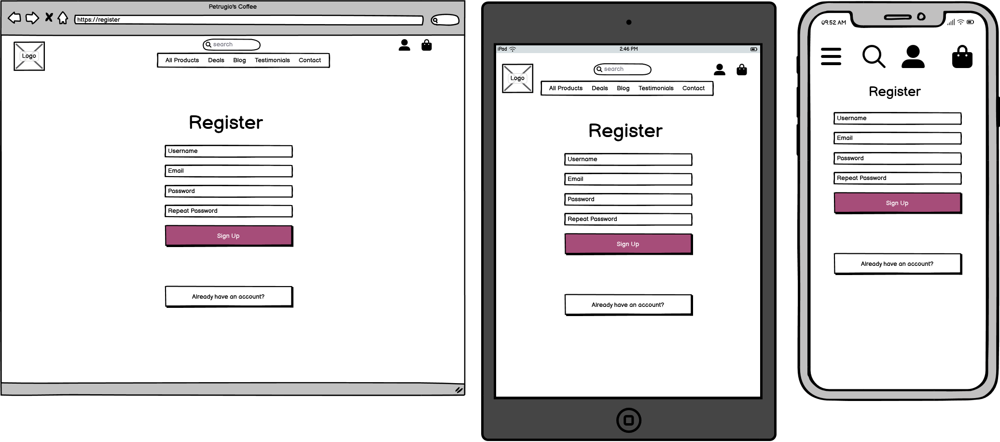
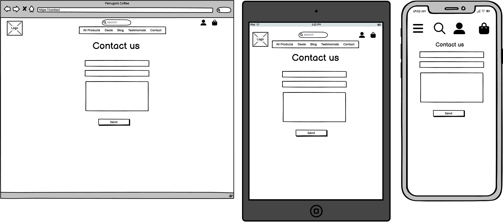

<h1 align="center">Petrugio's Coffee</h1>

View GitHub repository
<a href="https://github.com/petrugio/petrugio-s-coffee" target="_blank" rel="noopener">here</a>

View the live project
<a href="https://petrugio-s-coffee.herokuapp.com/" target="_blank" rel="noopener">here</a>

# Table of Contents

* [User Experience](#user-experience)
   * [Goals](#goals)
   * [Planing](#planning)
   * [User stories by Epic](#user-stories-by-epic)
* [Design](#design)
    * [Wireframes](#wireframes)
    * [Database](#database)
    * [Fonts](#fonts)
    * [Color Scheme](#color-scheme)
* [Development](#development)
* [Features](#features)
* [Testing](#testing)
    * [Responsive Design](#responsive-design)
    * [Validator Testing](#validator-testing)
        * [HTML5](#html5)
        * [CSS3](#css3)
        * [JavaScript](#javascript)
        * [Python](#python)
        * [Lighthouse](#lighthouse)
        * [Accessibility](#accessibility)
    * [Automated testing ](#automated-testing)
    * [Database testing ](#database-testing)
    * [Functional Testing ](#functional-testing)
    * [Browser Testing](#browser-testing)
* [Bugs](#bugs)
    * [Fixed Bugs](#fixed-bugs)
    * [Bug fix during testing](#bug-fix-during-testing)
    * [Unfixed Bugs](#unfixed-bugs)
* [Deployment](#deployment)
    * [Heroku](#heroku)
    * [Version Control](#version-control)
    * [How to Clone this repository](#how-to-clone-this-repository)
* [Technologies used](#technologies-used)
    * [Frameworks](#frameworks)
    * [Tools and tips](#tools-and-tips)
* [Credits](#credits)
* [Contact](#contact)
* [Acknowledgments](#acknowledgments)

# User Experience
 
## Goals

The goal of this website is to provide a pleasant way for interested customers to buy coffee at competitive prices, read blogs about coffee and coffee recipes.

## Planning 

Significant amount of time  was devoted to planing the layout and structure of the agile board.  
From the time remaining to submit a working project was decided to split the development into 5 iteration each lasting about 1 week.

After the project scope was clearly defined, following the process of creating milestones/epics, I added User Stories and Tasks to the Backlog and prioritized them using **M.o.S.C.o.W prioritization technique** and assigned them to the appropriate milestone/epic and iteration.

[Petrugio's Coffee Github project](https://github.com/users/petrugio/projects/5)

Bellow are screenshots of Agile planing, prioritization and development:

Screenshots

 

 

 

## User stories by Epic

- ### EPIC - Home App

  | No. | As a **(role)** | I can **(capability)** | so that **(received benefit)** |
  | --- | ------------ |------------| ------------|
  | [#3](https://github.com/petrugio/petrugio-s-coffee/issues/3) | User | view the home page | I can find out what potential benefit it can offer |
  | [#4](https://github.com/petrugio/petrugio-s-coffee/issues/4) | User | navigate the site | I can explore the site pages |
  | [#5](https://github.com/petrugio/petrugio-s-coffee/issues/5) | User | search the site | I can quickly find what I'm looking for, alternative way of looking for items |
  | [#6](https://github.com/petrugio/petrugio-s-coffee/issues/6) | User | see recent testimonials from previous customers/users | I can decide if the products might satisfy/suit me |
  | [#7](https://github.com/petrugio/petrugio-s-coffee/issues/7) | User | find links to social media sites | I can engage with this shop and share my experience |
  | [#8](https://github.com/petrugio/petrugio-s-coffee/issues/8) | User | subscribe to a newsletter | I can receive news and deals from the shop |
  | [#24](https://github.com/petrugio/petrugio-s-coffee/issues/24) | User | view feedback notifications | I can be sure the action was successful |

- ### EPIC - Profile App

  | No. | As a **(role)** | I can **(capability)** | so that **(received benefit)** |
  | --- | ------------ |------------| ------------|
  | [#9](https://github.com/petrugio/petrugio-s-coffee/issues/9) | User | register for an account | I can have a personal account and be able to view my profile |
  | [#10](https://github.com/petrugio/petrugio-s-coffee/issues/10) | User | receive a confirmation email after registering | I can make sure my account has been created |
  | [#11](https://github.com/petrugio/petrugio-s-coffee/issues/11) | User | login/logout of my account | I can have secure access to my profile |
  | [#12](https://github.com/petrugio/petrugio-s-coffee/issues/12) | User | recover my password | I can recover my password in case I forget it |
  | [#13](https://github.com/petrugio/petrugio-s-coffee/issues/13) | User | have a user profile | I can see my orders and personal information |

- ### EPIC - Products App

  | No. | As a **(role)** | I can **(capability)** | so that **(received benefit)** |
  | --- | ------------ |------------| ------------|
  | [#14](https://github.com/petrugio/petrugio-s-coffee/issues/14) | User | view the products | I can buy them if interested |
  | [#15](https://github.com/petrugio/petrugio-s-coffee/issues/15) | User | sort available products by different criteria | I can easily find the products matching my criteria |
  | [#16](https://github.com/petrugio/petrugio-s-coffee/issues/16) | User | see an individual page for each product | I can see all the details of this product |
  | [#17](https://github.com/petrugio/petrugio-s-coffee/issues/17) | Store Manager/admin | create, read, update and delete (CRUD functionality) a product | I can can sell it, update it or stop selling it on the website |
  
- ### EPIC - Basket App

  | No. | As a **(role)** | I can **(capability)** | so that **(received benefit)** |
  | --- | ------------ |------------| ------------|
  | [#18](https://github.com/petrugio/petrugio-s-coffee/issues/18) | User | add products to an online shopping basket | I can purchase multiple items |
  | [#19](https://github.com/petrugio/petrugio-s-coffee/issues/19) | User | see all the items in my shopping basket | I can double check if I added the needed quantity and sizes |
  | [#20](https://github.com/petrugio/petrugio-s-coffee/issues/20) | User | adjust the quantity of any product in my basket | I can buy the right amount |
  | [#21](https://github.com/petrugio/petrugio-s-coffee/issues/21) | User | remove products from my basket | I can choose not to buy them |
  | [#22](https://github.com/petrugio/petrugio-s-coffee/issues/22) | User | see the total value of my shopping basket | I can decide if it fits my budget |
  | [#23](https://github.com/petrugio/petrugio-s-coffee/issues/23) | User | see a notification when adding to/updating/removing from shopping basket | I can be sure the action was successful | 

- ### EPIC - Checkout App

  | No. | As a **(role)** | I can **(capability)** | so that **(received benefit)** |
  | --- | ------------ |------------| ------------|
  | [#25](https://github.com/petrugio/petrugio-s-coffee/issues/25) | User | fill in my contact details and delivery address | I can get products delivered to desired address |
  | [#26](https://github.com/petrugio/petrugio-s-coffee/issues/26) | User | safely checkout/pay for the products in my shopping basket | I can ensure my financial details are safe |
  | [#27](https://github.com/petrugio/petrugio-s-coffee/issues/27) | User | view an order confirmation after checkout | I can be sure the order and payment were successful |
  | [#28](https://github.com/petrugio/petrugio-s-coffee/issues/28) | User | receive an email confirmation after purchasing | I can have a record of the transaction |
  | [#29](https://github.com/petrugio/petrugio-s-coffee/issues/29) | Store Manager/admin | view placed orders and delivery details | I can ship the products to the customers at the address provided |
  | [#30](https://github.com/petrugio/petrugio-s-coffee/issues/30) | Store Manager/admin | edit placed orders and delivery details | I can modify/update orders if needed |
  | [#32](https://github.com/petrugio/petrugio-s-coffee/issues/31) | Store Manager/admin | delete placed orders | I can delete an order if a customer decides to cancel the order |

- ### EPIC - Blog App

  | No. | As a **(role)** | I can **(capability)** | so that **(received benefit)** |
  | --- | ------------ |------------| ------------|
  | [#33](https://github.com/petrugio/petrugio-s-coffee/issues/33) | User | view the blogs | I may decide to read a blog post if interested |
  | [#34](https://github.com/petrugio/petrugio-s-coffee/issues/34) | User | view the blog details | I can read the whole blog post |
  | [#35](https://github.com/petrugio/petrugio-s-coffee/issues/35) | User | 'like' a blog post | users/the author of the blog will see the impressions |
  | [#36](https://github.com/petrugio/petrugio-s-coffee/issues/36) | Store Manager/admin | create, read, update and delete (CRUD functionality) a blog post | the users of the site can read it or no longer read it |

- ### EPIC - Testimonials App

  | No. | As a **(role)** | I can **(capability)** | so that **(received benefit)** |
  | --- | ------------ |------------| ------------|
  | [#37](https://github.com/petrugio/petrugio-s-coffee/issues/37) | User | see all testimonials from previous customers/users | I can decide if the products might interest me |
  | [#38](https://github.com/petrugio/petrugio-s-coffee/issues/38) | User | create, read, update and delete (CRUD functionality) testimonials for the products I bought | I can share or stop sharing my experience with other customers |
  | [#39](https://github.com/petrugio/petrugio-s-coffee/issues/39) | Store Manager/admin | delete a testimonial | I can have a testimonial deleted if needed|

- ### EPIC - Contact App

  | No. | As a **(role)** | I can **(capability)** | so that **(received benefit)** |
  | --- | ------------ |------------| ------------|
  | [#40](https://github.com/petrugio/petrugio-s-coffee/issues/40) | User | submit a message to the Store Manager/admin | I can be contacted back regarding my question/issue |
  | [#41](https://github.com/petrugio/petrugio-s-coffee/issues/41) | Store Manager/admin | view messages sent to me by users | I can attempt to solve the issue |
  

# Design

## Wireframes
Wireframes were made using [Balsamiq](https://balsamiq.com/).
During development effort was put in to make the final website look and function as described in wireframe.

Screenshots

 

**Homepage**

**Products**

**Product detail**

**Basket**

**Checkout**

**Order Confirmation**

**Register**

**Login**

**Logout**

**Profile**

**Product management**

**Contact**

**Blog**

**Blog detail**

**Testimonials**

**Add Testimonial**

**404**

 

 

## Database

Custom data models were build for this project.
Bellow is the data model and Entity Relationship Diagram created with [DBeaver](https://dbeaver.io/) Universal Database Tool:

Screenshots

 

**Database schema in relation with logged in user**

**Allauth** library was used for the user authentication system, which utilities the built in Django User Model removed the need to build a custom User model for user authentication.

**Products** app model was adapted and modified for this project from Boutique Ado walk trough project

**Checkout** app model

**Profile** app model

**Blog** app model was build for this project to provide user useful information related to coffee, coffee products, coffee recipes. Logged in users have the ability to like a blog.

**Testimonials** app model was build for this project to provide user the ability to post a testimonial for other users to see. Logged in users that already made an order have the ability to post a testimonial.

**Contact** app model was build for this project to provide user the ability to contact site Manager/admin. Both users and logged in users have the ability to write a message trough the contact app. 

 

## Fonts
Google font [Bungee+Shade](https://fonts.google.com/specimen/Bungee+Shade) was used for the website. 

## Color Scheme
Contrast checker tool from [monsido.com](https://monsido.com/tools/contrast-checker) was  used to find a good contrast ratio.

Details

 

# Development

### [#1](https://github.com/petrugio/petrugio-s-coffee/issues/1) Issue: Install Django and dependencies (libraries)

Details

 

**Implementation:**

- Install Django
- Create project `petrugio_s_coffee`
- Install required libraries, external and internal packages listed in [Technologies used](#technologies-used)
- Create requirements file to track dependencies, using command `pip3 freeze > requirements.txt`

### [#2](https://github.com/petrugio/petrugio-s-coffee/issues/2) Issue: Early deployment to Heroku

Details

 

**Implementation:**

- Create an env.py file to store the environment variables
- Amend Django to point to the new location for the secret keys
- Add the env.py file to the .gitignore file so that it does not get pushed to - GitHub
- Create a new Heroku app
- Create a new Postgress database on ElephantSQL
- Add the database to the app resources
- Add the secret key's to the Heroku config vars
- Configure the settings.py file to point at the correct env.py file in development, the os in deployment and adjust the database section to point at the correct database url from Heroku in deployment
- Add USE_AWS variable to Heroku config vars.
- Add the Amazon AWS S3 bucket details to the env.py file and to the Heroku config vars. Access Key and Secret Access Key.
- Add the email user details and password to the env.py file and to the Heroku config vars
- Add the stripe details to the env.py file and to the Heroku config vars. Public key, secret key and wh-secret

### [#3](https://github.com/petrugio/petrugio-s-coffee/issues/3) [#60](https://github.com/petrugio/petrugio-s-coffee/issues/60) USER STORY: Home page, Add 400 and 500 error pages

Details

 

**Acceptance Criteria:**
   - 1: A functioning and responsive homepage
   - 2: If the users have accessed a page that doesn't exist - a 404 error page is displayed 
   - 2: If the users have accessed a page that doesn't suppose to access  - a 403 error page is displayed
   - 3: If an internal server error occurs - a 500 error page is displayed
   
**Implementation:**

- Create an `Home` app 
- Create urls, views and templates
- Create 403, 404, 500 Pages

### [#4](https://github.com/petrugio/petrugio-s-coffee/issues/4) USER STORY: Navigation

Details

 

**Acceptance Criteria:**
- 1: A functioning navigation menu that takes the user to specific pages when clicked 
- 2: A drop-down menu that displays products: products, products by category, and products by intensity
- 3: A drop-down menu that displays current deals  
- 4: Links to other pages: Blog, Testimonials, Contact  
- 3: Menu should be responsive so that it provides an intuitive way of navigating the site regardless of the device used
   
**Implementation:**

- Create Navigation menu with all the required drop-downs and links

### [#5](https://github.com/petrugio/petrugio-s-coffee/issues/5) USER STORY: Search

Details

 

**Acceptance Criteria:**
- 1: A functioning and responsive search box that can return searched term in name or description of products

**Implementation:**

- Search functionality created as per acceptance criteria
- Current iteration provides search functionality only for `Products` app

### [#6](https://github.com/petrugio/petrugio-s-coffee/issues/6) USER STORY: Testimonials section

Details

 

**Acceptance Criteria:**
- 1: A functioning and responsive testimonial section on the homepage that displays 3 most recent testimonials

**Implementation:**

- Testimonial section created as per acceptance criteria
- A temporary testimonial section was put in place until `Testimonials` app was developed

### [#7](https://github.com/petrugio/petrugio-s-coffee/issues/7) USER STORY: Social media

Details

 

**Acceptance Criteria:**
- 1: A functioning and responsive social media section in the footer of pages, what takes the user to the required social media site  
- 2: Visible links to : Facebook, Instagram, YouTube 

**Implementation:**

- Social media section created as per acceptance criteria
- Links takes the user to the generic .com domain since this is a demo website, can be changed to later to customer profile on social media

### [#8](https://github.com/petrugio/petrugio-s-coffee/issues/8) USER STORY: Newsletter

Details

 

**Acceptance Criteria:**
- 1: A functioning and responsive sign-up form in the footer that allows the user to sign-up to a mailing list
- 2: The only required field is email 

**Implementation:**

- Sign-up form created as per acceptance criteria
- Mailchimp was set up as a infrastructure for managing mailing list and campaigns.
- The process involved:
  - Setting up a Mailchimp account
  - Longing in into the account and setting up a embedded email collecting form using Mailchimp wizard
  - Taking the code provided and implementing it on our website

### [#9](https://github.com/petrugio/petrugio-s-coffee/issues/9) [#10](https://github.com/petrugio/petrugio-s-coffee/issues/10) [#11](https://github.com/petrugio/petrugio-s-coffee/issues/11) [#12](https://github.com/petrugio/petrugio-s-coffee/issues/12) USER STORY: Registration, Confirmation email, Login/logout, Password recovery

Details

 

**Acceptance Criteria:**
- 1: A functioning and responsive registration page that allows the user to register for an account 
- 2: If the registration form is completed correctly a the user should get an email to confirm registration
- 3: After successful registration the user should be able to login and avail of extra functionality for registered users
- 4: The user should be able to reset his/her password if lost  

**Implementation:**

- User registration created as per acceptance criteria
- Django `allauth` library was used to handle user registration since it has good functionality and security

### [#13](https://github.com/petrugio/petrugio-s-coffee/issues/13) USER STORY: User profile

Details

 

**Acceptance Criteria:**
- 1: A functioning and responsive profile page that allows the user to add, modify personal details and delivery information
- 2: A functioning history of past orders 
- 3: The following fields should be saved to profile: Phone Number, Postal Code, Town or City, Street Address 1, Street Address 2, County, State or Locality, Country

**Implementation:**

- Create an `Profiles` app
- Profile page created as per acceptance criteria  
- `django-countries` library was used to handle counties input since it has good functionality and compatibility with our payment processor `Stripe`

### [#14](https://github.com/petrugio/petrugio-s-coffee/issues/14) USER STORY: Products

Details

 

**Acceptance Criteria:**
- 1: A functioning and responsive products page that allows the user to browse products
- 2: Each product should have displayed: an image, price, weight, intensity, rating 

**Implementation:**

- Create an `Products` app
- Product page created as per acceptance criteria  

### [#15](https://github.com/petrugio/petrugio-s-coffee/issues/15) USER STORY: Sort functionality

Details

 

**Acceptance Criteria:**
- 1: A functioning sorting section that allows the user to sort products by price, name, category, rating both ascending and descending 
- 2: Total number of products found during sorting, searching, filtering should be display 

**Implementation:**

- Sort functionality created as per acceptance criteria  

### [#16](https://github.com/petrugio/petrugio-s-coffee/issues/16) USER STORY: Product details

Details

 

**Acceptance Criteria:**
- 1: A functioning and responsive products detail page that allows the user see product's image, price, weight, intensity, rating, description
- 2: A input field that allows the user to select the desired quantity
- 3: A button to add the product to the basket
- 4: A button to go back to the product list

**Implementation:**

- Product details page created as per acceptance criteria  

### [#17](https://github.com/petrugio/petrugio-s-coffee/issues/17) USER STORY: Product CRUD functionality

Details

 

**Acceptance Criteria:**
- 1: A functioning and responsive products management pages that allows the owner/admin to add/edit a product
- 3: A functioning edit/delete button owner/admin can see on each product when on each product he/she is logged in

**Implementation:**

- Product CRUD functionality created as per acceptance criteria  

### [#18](https://github.com/petrugio/petrugio-s-coffee/issues/18) USER STORY: Add to basket

Details

 

**Acceptance Criteria:**
- 1: A functioning product basket app where user can see a add products for later review/chekout

**Implementation:**

- Create an `Basket` app
- Add to basket functionality created as per acceptance criteria   

### [#19](https://github.com/petrugio/petrugio-s-coffee/issues/19) [#20](https://github.com/petrugio/petrugio-s-coffee/issues/20) [#21](https://github.com/petrugio/petrugio-s-coffee/issues/21) [#22](https://github.com/petrugio/petrugio-s-coffee/issues/22) USER STORY: View shopping basket, Update shopping basket, Remove from basket, Shopping basket total 

Details

 

**Acceptance Criteria:**
- 1: A functioning and responsive product basket page where user can see a list of products that he/she added to the basket
- 2: Each product in the basket should have an image, product name, product sku, price, quantity and subtotal
- 3: Users can modify product quantity or remove the product from the basket by using a input and update/remove buttons 
- 4: A banner below the navbar should display Free delivery threshold amount, which should be set to $20
- 5: At the bottom of the list should be displayed:
     - Basket total
     - Delivery cost
     - Grand total
     - Display the amount of money a user need to spend to qualify for free delivery
- 6: A button to to proceed to checkout
- 7: A button to go back to the product list

**Implementation:**

- All requirements on the shopping basket page created as per acceptance criteria   

### [#23](https://github.com/petrugio/petrugio-s-coffee/issues/23) USER STORY: Basket notification

Details

 

**Acceptance Criteria:**
- 1: A functioning mini basket notification app where user can see at a glance a miniature basket in the top right corner
- 2: At the bottom part of basket notification the user should have a button to take him/her to the main basket page
**Implementation:**

- Basket notification created as per acceptance criteria   

### [#24](https://github.com/petrugio/petrugio-s-coffee/issues/24) USER STORY: Notifications

Details

 

**Acceptance Criteria:**
- 1: A functioning notification system to provide feedback to the user about the success/ failure of an action or an input
- 2: Notification should work on all apps and pages

**Implementation:**

- Notifications created as per acceptance criteria
- Implemented bootstrap notification(toasts) in combination with django messages which provide 4 types of notification:
     - Toast success - when an action is successful   
     - Toast info - to provide info
     - Toast warning - to provide warning to the user that something is not right
     - Toast error - when there is a critical error 

### [#25](https://github.com/petrugio/petrugio-s-coffee/issues/25) USER STORY: Contact details and delivery address

Details

 

**Acceptance Criteria:**
- 1: A functioning and responsive checkout page where user can see a list of products that were present in the basket prior to checkout  
- 2: The checkout page should be comprised of two parts: Contact details and delivery address and order summary section
- 2: Order summary section comprising of an image, product name, quantity, and subtotal for each line item (product) 
- 3: At the bottom of the order summary should be displayed:
     - Order Total
     - Delivery
     - Grand total
- 4: Contact details and delivery address section should be comprised of: details, delivery and payment:
     - Details should have the fields for full name, and email
     - Delivery should have the fields for Phone Number, Postal Code, Town or City, Street Address 1, Street Address 2, County, State or Locality, Country
     - A checkbox that allows the user to save the information in the `Profile` app for future use
     - Payment section 

**Implementation:**
- Create an `Checkout` app
- Checkout page created as per acceptance criteria

### [#26](https://github.com/petrugio/petrugio-s-coffee/issues/26) USER STORY: Checkout/pay

Details

 

**Acceptance Criteria:**
- 1: A functioning payment section should provide the user the ability to safely checkout with a credit card 

**Implementation:**
- Payment section created as per acceptance criteria
- `Stripe` was used as a payment processor provider, the setup process involved:
   - making an account with stripe
   - using templates from stripe to make a secure payment form
   - configure webhooks for both local and Heroku deployed project
   - setup message system to keep customer informed on processing status
   - redirect to appropriate page depending on payment outcome

### [#27](https://github.com/petrugio/petrugio-s-coffee/issues/27) USER STORY: Checkout confirmation

Details

 

**Acceptance Criteria:**
- 1: A functioning confirmation page shown to the user after successful checkout
- 2: Page should have a order info, order details, delivery details, and billing info

**Implementation:**
- Checkout confirmation page created as per acceptance criteria

### [#28](https://github.com/petrugio/petrugio-s-coffee/issues/28) USER STORY: Checkout confirmation email

Details

 

**Acceptance Criteria:**
- 1: A functioning confirmation email send to the user after successful checkout

**Implementation:**
- Checkout confirmation email created as per acceptance criteria
- Gmail was used as email infrastructure to send emails
- The setup process involved:
   - Setting up a google account
   - Adding 2FA to the account 
   - Setting up a app password
   - Configure django settings to use gmail as a emailing back-end 
   - Adding login details to Heroku config vars

### [#29](https://github.com/petrugio/petrugio-s-coffee/issues/29) [#30](https://github.com/petrugio/petrugio-s-coffee/issues/30) [#32](https://github.com/petrugio/petrugio-s-coffee/issues/32) USER STORY: Admin view placed orders, Admin edit placed orders, Admin delete placed orders

Details

 

**Acceptance Criteria:**
- 1: Owner/admin has the ability to view, sort, edit or delete orders using django admin panel 

**Implementation:**
- User story implemented as per acceptance criteria
- The setup process involved:
  - Registering the `Checkout` app with django admin by configuring admin.py file in the checkout app

### [#33](https://github.com/petrugio/petrugio-s-coffee/issues/33) USER STORY: View blogs

Details

 

**Acceptance Criteria:**
- 1: A functioning and responsive blogs page that can be navigated to from the nav menu
- 2: Each blog should have an image, title, content, date created and the number of likes 

**Implementation:**
- Create an `Blog` app
- User story implemented as per acceptance criteria
 

### [#34](https://github.com/petrugio/petrugio-s-coffee/issues/34) [#35](https://github.com/petrugio/petrugio-s-coffee/issues/35) USER STORY: View blog details, Like a blog post

Details

 

**Acceptance Criteria:**
- 1: A functioning and responsive blogs details page that can be navigated to when clicking on a blog post
- 2: Each blog details page should have an image, title, content, date created, date updated, number of likes and a back button 
- 3: Functionality for logged in user to like a blog

**Implementation:**
- User stories implemented as per acceptance criteria
 

### [#36](https://github.com/petrugio/petrugio-s-coffee/issues/36) USER STORY: Admin CRUD blog post

Details

 

**Acceptance Criteria:**
- 1: Functionality for Manager/admin create, read, update and delete (CRUD functionality) blogs

**Implementation:**
- User story implemented as per acceptance criteria
- The setup process involved:
  - Registering the `Blog` app with django admin by configuring admin.py file in the blog app
  - `django-summernote` library was used as text editor to provide extra test editor capabilities 
  - Configuration of `django-summernote` was done by adding required functionality to django settings
 

### [#37](https://github.com/petrugio/petrugio-s-coffee/issues/37) USER STORY: View testimonials

Details

 

**Acceptance Criteria:**
- 1: A functioning and responsive testimonials page that can be navigated to from the nav menu
- 2: User is able to see testimonials from other users comprising of:
  - A title 
  - Short preview of the content 
  - Date created 
  - Author 
 - 3: A functioning and responsive testimonial detail page that can be navigated when clicking on a testimonial comprising of:
  - A title 
  - The content 
  - Date created
  - Date updated
  - Author 
  - Back button

**Implementation:**
- Create an `Testimonials` app
- User story implemented as per acceptance criteria
- Title and content is displayed partially on the testimonials page to avoid one testimonial occupying the whole page

### [#38](https://github.com/petrugio/petrugio-s-coffee/issues/38) USER STORY: Users CRUD testimonials

Details

 

**Acceptance Criteria:**
- 1: Functionality for logged in users that previously made an order to add/edit/delete a testimonial
- 2: Users should be able to edit only their own testimonials

**Implementation:**
- User story implemented as per acceptance criteria
- `django-summernote` library was used as text editor to provide extra test editor capabilities 
- Configuration of `django-summernote` was done by adding required functionality to django settings
- When adding a testimonial the field author is saved (in the background) with current logged in user
- When logged in, users can see an `Edit` and `Delete` button on each of their own testimonials

### [#39](https://github.com/petrugio/petrugio-s-coffee/issues/39) USER STORY: Admin delete testimonials

Details

 

**Acceptance Criteria:**
- 1: Manager/Admin should be able to delete any testimonials from testimonials page and testimonial detail page
- 2: Functionality for Manager/admin create, read, update and delete (CRUD functionality) testimonials via Django admin

**Implementation:**
- User story implemented as per acceptance criteria
- The setup process involved:
  - Registering the `Testimonials` app with django admin by configuring admin.py file in the testimonials app

### [#40](https://github.com/petrugio/petrugio-s-coffee/issues/40) USER STORY: User submit message

Details

 

**Acceptance Criteria:**
- 1: A functioning and responsive contact page that can be navigated to from the nav menu
- 2: Contact us form should have the fields: name, email, message

**Implementation:**
- Create an `Contact` app
- User story implemented as per acceptance criteria
 

### [#41](https://github.com/petrugio/petrugio-s-coffee/issues/41) USER STORY: Admin view messages

Details

 

**Acceptance Criteria:**
- 1: Functionality for Manager/admin create, read, update and delete (CRUD functionality) testimonials via Django admin

**Implementation:**
- Create an `Contact` app
- User story implemented as per acceptance criteria
- The setup process involved:
  - Registering the `Contact` app with django admin by configuring admin.py file in the contact app
 

### [#63](https://github.com/petrugio/petrugio-s-coffee/issues/63) Issue: Bugs, typos, errors

Details

 

**Implementation:**
- When a bug, typo or an error was found it was fixed or attempted to be fixed
 

# Features

### [#3](https://github.com/petrugio/petrugio-s-coffee/issues/3) [#60](https://github.com/petrugio/petrugio-s-coffee/issues/60) USER STORY: Home page, Add 400 and 500 error pages

Details

 

**Desktop**

**Tablet**

**Mobile**

**403**

**404**

### [#4](https://github.com/petrugio/petrugio-s-coffee/issues/4) USER STORY: Navigation

Details

 

**Desktop**

**Tablet and Mobile**

**Nav expanded**

**Nav deals**

**Nav account**

### [#5](https://github.com/petrugio/petrugio-s-coffee/issues/5) USER STORY: Search

Details

 

**Desktop**

**Tablet and Mobile**

**Tablet and Mobile**

### [#6](https://github.com/petrugio/petrugio-s-coffee/issues/6) USER STORY: Testimonials section

Details

 

**Desktop**

**Tablet and Mobile**

### [#7](https://github.com/petrugio/petrugio-s-coffee/issues/7) USER STORY: Social media

Details

 

**Desktop**

**Tablet and Mobile**

### [#8](https://github.com/petrugio/petrugio-s-coffee/issues/8) USER STORY: Newsletter

Details

 

**Desktop**

**Tablet and Mobile**

**Newsletter**

**Newsletter subscribed**

**Newsletter subscribed mailchimp**

### [#9](https://github.com/petrugio/petrugio-s-coffee/issues/9) [#10](https://github.com/petrugio/petrugio-s-coffee/issues/10) [#11](https://github.com/petrugio/petrugio-s-coffee/issues/11) [#12](https://github.com/petrugio/petrugio-s-coffee/issues/12) USER STORY: Registration, Confirmation email, Login/logout, Password recovery

Details

 

**Sign up**

**User register**

**Got email**

**Confirm email**

**Confirm success**

**Login**

**Logout**

**Logged in user**

**Logged in admin**

### [#13](https://github.com/petrugio/petrugio-s-coffee/issues/13) USER STORY: User profile

Details

 

**Desktop**

**Tablet**

**Mobile**

### [#14](https://github.com/petrugio/petrugio-s-coffee/issues/14) USER STORY: Products

Details

 

**Desktop**

**Tablet**

**Mobile**

### [#15](https://github.com/petrugio/petrugio-s-coffee/issues/15) USER STORY: Sort functionality

Details

 

**Sort**

### [#16](https://github.com/petrugio/petrugio-s-coffee/issues/16) USER STORY: Product details

Details

 

**Desktop**

**Tablet**

**Mobile**

### [#17](https://github.com/petrugio/petrugio-s-coffee/issues/17) USER STORY: Product CRUD functionality

Details

 

**Product add**

**Product add**

**Product add**

**Product edit**

**Product delete**

### [#18](https://github.com/petrugio/petrugio-s-coffee/issues/18) USER STORY: Add to basket

Details

 

**Basket Add**

**Basket Added**

### [#19](https://github.com/petrugio/petrugio-s-coffee/issues/19) [#20](https://github.com/petrugio/petrugio-s-coffee/issues/20) [#21](https://github.com/petrugio/petrugio-s-coffee/issues/21) [#22](https://github.com/petrugio/petrugio-s-coffee/issues/22) USER STORY: View shopping basket, Update shopping basket, Remove from basket, Shopping basket total 

Details

 

**Desktop**

**Tablet**

**Mobile**

**Basket update**

**Basket updated**

**Basket remove**

**Basket removed**

### [#23](https://github.com/petrugio/petrugio-s-coffee/issues/23) USER STORY: Basket notification

Details

 

**Mini basket**

### [#24](https://github.com/petrugio/petrugio-s-coffee/issues/24) USER STORY: Notifications

Details

 

**Success message**

**Error message**

### [#25](https://github.com/petrugio/petrugio-s-coffee/issues/25) USER STORY: Contact details and delivery address

Details

 

**Desktop**

**Tablet**

**Mobile**

### [#26](https://github.com/petrugio/petrugio-s-coffee/issues/26) [#27](https://github.com/petrugio/petrugio-s-coffee/issues/28) [#28](https://github.com/petrugio/petrugio-s-coffee/issues/28) USER STORY: Checkout/pay, Checkout confirmation, Checkout confirmation email

Details

 

**Checkout/pay**

**Pay overlay**

**Pay confirm**

**Pay confirmation email**

### [#29](https://github.com/petrugio/petrugio-s-coffee/issues/29) [#30](https://github.com/petrugio/petrugio-s-coffee/issues/30) [#32](https://github.com/petrugio/petrugio-s-coffee/issues/32) USER STORY: Admin view placed orders, Admin edit placed orders, Admin delete placed orders

Details

 

**Admin view all orders**

**Admin order view**

**Admin order edit**

**Admin order edited**

**Admin order delete**

**Admin order delete confirm**

**Admin order deleted**

### [#33](https://github.com/petrugio/petrugio-s-coffee/issues/33) USER STORY: View blogs

Details

 

**Desktop**

**Tablet**

**Mobile**

### [#34](https://github.com/petrugio/petrugio-s-coffee/issues/34) [#35](https://github.com/petrugio/petrugio-s-coffee/issues/35) USER STORY: View blog details, Like a blog post

Details

 

**Desktop**

**Tablet**

**Mobile**

**Blog press like**

**Blog like message**

**Blog unlike message**

### [#36](https://github.com/petrugio/petrugio-s-coffee/issues/36) USER STORY: Admin CRUD blog post

Details

 

**Admin blog view**

**Admin blog add**

**Admin blog edit**

**Admin blog delete confirm**

**Admin blog deleted**

### [#37](https://github.com/petrugio/petrugio-s-coffee/issues/37) USER STORY: View testimonials

Details

 

**Desktop**

**Tablet**

**Mobile**

### [#38](https://github.com/petrugio/petrugio-s-coffee/issues/38) USER STORY: Users CRUD testimonials

Details

 

**Add testimonial Desktop**

**Add testimonial Tablet**

**Add testimonial Mobile**

**Add testimonial message**

**Testimonial buttons**

**Testimonial edit**

**Testimonial edited**

**Testimonial edit message**

**Testimonial delete message**

### [#39](https://github.com/petrugio/petrugio-s-coffee/issues/39) USER STORY: Admin delete testimonials

Details

 

**Admin Testimonial delete**

**Add testimonial Django Admin**

**Testimonial edit Django Admin**

**Testimonial delete message**

### [#40](https://github.com/petrugio/petrugio-s-coffee/issues/40) USER STORY: User submit message

Details

 

**Desktop**

**Tablet**

**Mobile**

**Sent message**

**Sent message success**

### [#41](https://github.com/petrugio/petrugio-s-coffee/issues/41) USER STORY: Admin view messages

Details

 

**Admin view all messages**

**Admin CRUD message**

# Testing

## Responsive Design
[Chrome Developer Tools](https://developer.chrome.com/docs/devtools/) and [Pesticide Chrome extension](https://chrome.google.com/webstore/detail/pesticide-for-chrome-with/neonnmencpneifkhlmhmfhfiklgjmloi) was regularly used during development to test responsiveness on different  screen sizes.   
To make the website responsive [Bootstrap 4](https://getbootstrap.com/docs/4.0/getting-started/introduction/) and CSS was used.
Responsiveness for different screen sizes can be seen in the features section above. 

## Validator Testing

### HTML5
Code passed official [W3C Validator testing](https://validator.w3.org/#validate_by_uri).

Screenshots

 

**Homepage**

**Sign up**

**Login**

**Products**

**Product detail**

**Blog**

**Blog detail**

**Testimonials**

**Testimonial detail**

**Contact**

 

### CSS3

Css passed official [W3C Validator testing](https://jigsaw.w3.org/css-validator/). There were no mistakes in my CSS.

Screenshots

 

By URI

 

### Javascript

The alert function was tested with [jshint.com](https://jshint.com/). No errors found.

Screenshots

 

**Stripe-elements.js**

**Quantity-input-script.js**

**Summernote**

 

### Python

The code was tested with [pycodestyle](https://pypi.org/project/pycodestyle/) extension in Gitpod. No mistakes found.
Few generic Django lines of code are showing a warning of "Line too long". When i tied to make the lines shorter by indenting them with \ or "" python methods - Django breaks and cannot run any code.  
Since this is generic Django code it was left as it is.

Screenshots

 

**Setting.py**

 

### Automated testing
As the time permitted some automated testing was performed to check if pages load, give a 200 or 404 response

Screenshots

 

**Homepage**

**Homepage**

**Profile**

**Basket**

 

### Lighthouse

Pages were tested with [Chrome Developer Tools](https://developer.chrome.com/docs/devtools/) using the [Lighthouse](https://developers.google.com/web/tools/lighthouse) resource.

Screenshots

 

 

### Accessibility

Accessibility was tested during development using [Wave Chrome extension](https://wave.webaim.org/) and after final deployment was tested with **accessibilitytest.org**

[Accessibility test result ](https://accessibilitytest.org/results/_ws0HhePZuCx)

Screenshots

 

 

## Automated testing
As the time permitted some automated testing was performed to check if pages load, give a 200 or 404 response

Screenshots

 

**Homepage**

**Homepage**

**Profile**

**Basket**

 

## Database testing

Screenshots

 

**Profile gets saved to database**

## Functional Testing

Functional Testing can be view in [Functional_Testing.md](Functional_Testing.md)
